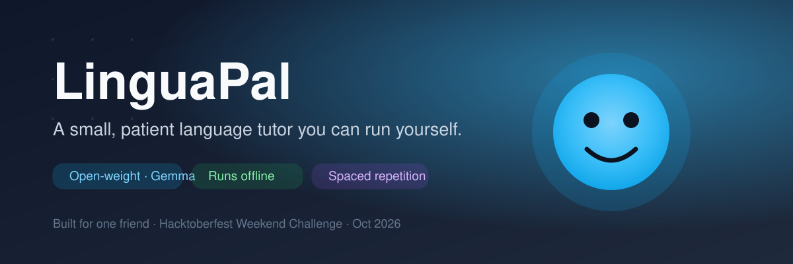
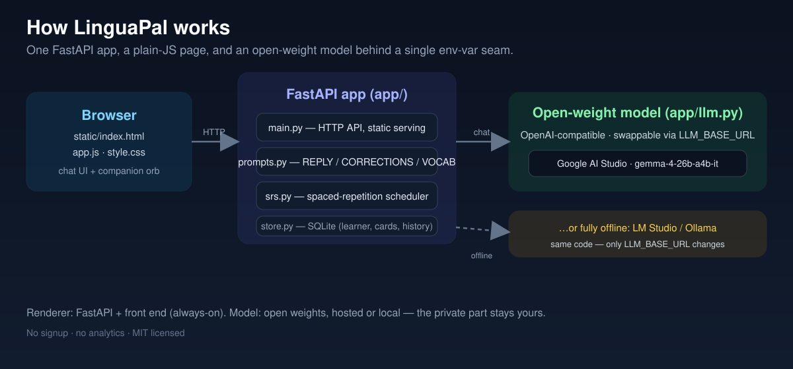

<div align="center">

# LinguaPal

**A small, patient language tutor that runs on your own machine — built for one friend.**



[](LICENSE)


Built for the **Hacktoberfest Weekend Challenge: Build for a Friend** (Oct 2–5, 2026).

[](https://render.com/deploy?repo=https://github.com/surajns0033-collab/linguapal)

</div>

LinguaPal is a language-practice partner for **one real person** — my friend, who is
learning a new language and gets nervous about making mistakes. It chats with her at
her level, corrects her gently with a short explanation, turns new words into
flashcards automatically, and schedules those cards for review. Everything runs on a
**local open-weight model**, and her practice never leaves her machine.

---

## Contents

- [The idea](#the-idea)
- [Features](#features)
- [How it works](#how-it-works)
- [Tech stack](#tech-stack)
- [Getting started](#getting-started)
- [Configuration](#configuration)
- [Project structure](#project-structure)
- [HTTP API](#http-api)
- [Deployment](#deployment)
- [Why open weights](#why-open-weights)
- [License](#license)

---

## The idea

Most practice apps send every half-wrong sentence to a company's server, and grade it.
For a shy learner that is the worst possible design: the fear of being watched is
stronger than the fear of being wrong.

LinguaPal inverts that. The model runs locally, nothing is uploaded, and the feedback
is phrased like a friend — *"you wrote `yo soy cansado`; for a state like this it's
`estoy cansado`"* — never a red mark. The goal isn't to test her; it's to make her
comfortable enough to keep going.

## Features

- **Conversation practice** in the target language, tuned to beginner / intermediate / advanced.
- **Gentle corrections** parsed out of the model's reply — explained in one line, never mocked.
- **Automatic vocabulary cards** — every new word the tutor introduces becomes a review card.
- **Spaced repetition** (a small SM-2 scheduler) so words come back at the right time.
- **Meaningful progress** — retention %, cards due now, matured cards, turns practised.
- **Memory of weak spots** — terms the learner keeps lapsing on are woven back into later prompts.
- **A companion orb** — a small mood indicator (thinking / happy / gently-correcting) that
  makes the tutor feel like a pal rather than a grader.

## How it works



```
Browser (plain HTML/CSS/JS)  ──►  FastAPI (app/main.py)
                                   ├─ llm.py      → OpenAI-compatible endpoint
                                   │                (LM Studio :1234, Ollama :11434,
                                   │                 or any hosted open-weight server)
                                   ├─ prompts.py  → tutor + drill prompts
                                   ├─ store.py    → SQLite: learner, messages, cards
                                   └─ srs.py      → spaced-repetition scheduler
```

The key design choice: the model is treated as a **component, not an oracle**. The
prompt asks for a strict three-part reply — the conversation, a list of corrections,
and any new vocabulary — and `llm.py` parses that into structured data. One inference
call yields the reply, the feedback, *and* the flashcards. The scheduler lives in plain
Python, so progress is deterministic and instant even on a small model.

The app talks to any **OpenAI-compatible** endpoint. Locally that's LM Studio or
Ollama; when hosted, it's a remote open-weight endpoint. The model stays swappable —
no closed API is ever in the loop.

## Tech stack

| Layer | Choice | Why |
| --- | --- | --- |
| Model | Gemma (open weights) — `gemma-4-26b-a4b-it` hosted, Gemma 3n E2B / Gemma 3 4B locally | Small enough to run on a laptop, capable enough to tutor |
| Inference | LM Studio / Ollama locally, Google AI Studio (Gemma) when hosted — all OpenAI-compatible | One interop layer, many models |
| Backend | FastAPI + Uvicorn | Small, typed, async |
| Storage | SQLite (stdlib) | Single local file, zero setup |
| Frontend | Plain HTML/CSS/JS | No build step, easy to fork |
| Hosting | Render (Docker) | One-click deploy for the hosted demo |

## Getting started

### 1. Start an open-weight model

Pick either:

- **LM Studio** — load a small model (developed and demoed on `google/gemma-3n-e2b`;
  `google/gemma-3-4b-it` or `meta-llama/llama-3.2-3b-instruct` also work), then
  *Developer → Start Server* (port `1234`).
- **Ollama** — `ollama serve` and `ollama pull gemma3:4b`.

### 2. Run the app

```bash
python -m venv .venv
.venv\Scripts\activate          # Windows  (macOS/Linux: source .venv/bin/activate)
pip install -r requirements.txt
copy .env.example .env          # then edit if needed   (macOS/Linux: cp)
uvicorn app.main:app --reload --port 8000
```

Open <http://localhost:8000>, tell it who you're helping, and start practising.

> Auto-detection tries LM Studio first, then Ollama. Point `LLM_BASE_URL` / `LLM_MODEL`
> at any other OpenAI-compatible server to override.

## Configuration

All settings are optional; sensible defaults are shown. See [`.env.example`](.env.example).

| Variable | Default | Purpose |
| --- | --- | --- |
| `LLM_BASE_URL` | auto-detected | Base URL of the OpenAI-compatible endpoint (`…/v1`) |
| `LLM_MODEL` | auto-detected | Model id to request |
| `LLM_API_KEY` | *(empty)* | Bearer key, only if the endpoint requires one |
| `LLM_TEMPERATURE` | `0.6` | Sampling temperature |
| `LLM_TIMEOUT` | `120` | Per-request timeout (seconds) |
| `LLM_MAX_TOKENS` | `180` | Reply cap — keeps small models fast |
| `DATA_DIR` | `./data` | Where the SQLite database lives |
| `SENTRY_DSN` | *(empty)* | Optional error reporting |
| `PORT` | `8000` | Server port |

## Project structure

```
linguapal/
├─ app/
│  ├─ main.py        FastAPI app + routes
│  ├─ config.py      environment-driven settings
│  ├─ llm.py         OpenAI-compatible client + reply parser
│  ├─ prompts.py     tutor and drill prompts
│  ├─ store.py       SQLite persistence (learner, messages, cards)
│  └─ srs.py         spaced-repetition scheduler
├─ static/
│  ├─ index.html     single page
│  ├─ app.js         UI logic
│  └─ style.css      styles
├─ smoke_test.py     end-to-end check against a running server
├─ Dockerfile        container build
├─ render.yaml       Render blueprint
├─ requirements.txt
├─ .env.example
└─ LICENSE
```

## HTTP API

| Method | Path | Description |
| --- | --- | --- |
| `GET` | `/api/health` | App status + detected model |
| `GET` | `/api/learner` | Current learner + stats |
| `POST` | `/api/setup` | Create the learner (name, language, level) |
| `POST` | `/api/chat` | One tutor turn → reply, corrections, vocab |
| `GET` | `/api/drill?topic=…` | Start a themed practice prompt |
| `GET` | `/api/review` | Cards due now |
| `POST` | `/api/review` | Grade a card (SM-2 update) |
| `GET` | `/api/stats` | Progress summary |
| `POST` | `/api/reset` | Clear local practice history |

## Deployment

The app and front end can be hosted on **Render** while the model runs wherever you
point it — a laptop, a home server, or a hosted open-weight endpoint.

1. Push the repo and create a Render **Web Service** (the `Dockerfile` and `render.yaml` are included).
2. Set `LLM_BASE_URL` to your endpoint's `/v1` URL, `LLM_MODEL` to its model id, and
   `LLM_API_KEY` if required — this lets the hosted app run with **no local GPU**.
3. Optionally mount a disk and set `DATA_DIR` so review history persists across deploys.

## Why open weights

This isn't a detail — it's the feature:

- **Private by default.** A beginner's halting sentences shouldn't sit on someone else's
  server. Everything lives in one local SQLite file.
- **Works offline.** Practice on a train or a flight.
- **No per-token bill.** She can make a hundred mistakes without feeling she's "using up" an API.
- **Swappable — model *and* host.** Gemma today, Llama or Qwen tomorrow; on a laptop tonight,
  on a hosted endpoint when she wants a public link. One env var, no code change.
- **Yours to change.** The prompt, the scheduler, the UI — all editable.

## License

Released under the [MIT License](LICENSE) — the code is free to use, modify, and share.

> Note: the **model weights** are governed by their own licenses (for example, the
> Gemma Terms of Use), which are separate from this project's MIT license.

## Acknowledgements

- [Google Gemma](https://ai.google.dev/gemma) — the open-weight model behind the tutor.
- [LM Studio](https://lmstudio.ai/) and [Ollama](https://ollama.com/) — local inference.
- [FastAPI](https://fastapi.tiangolo.com/) and [Uvicorn](https://www.uvicorn.org/).
